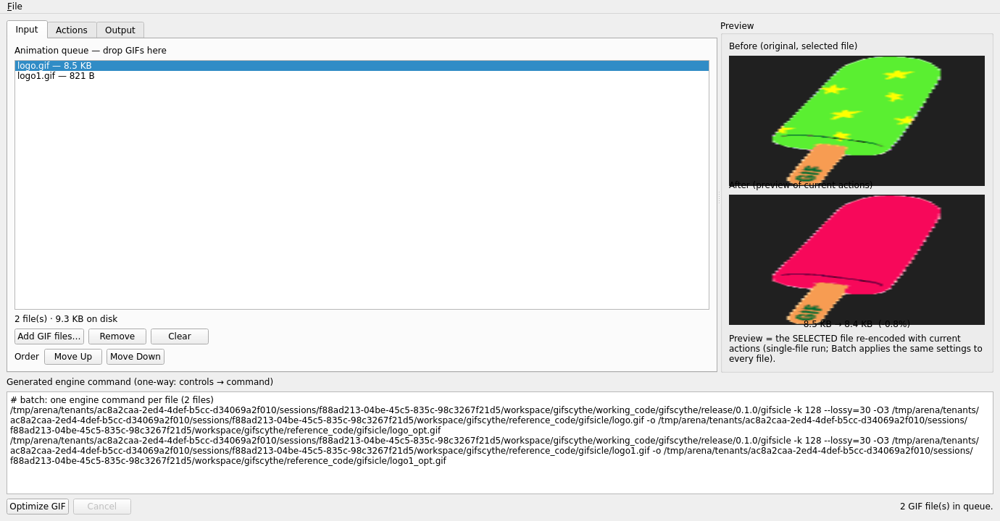
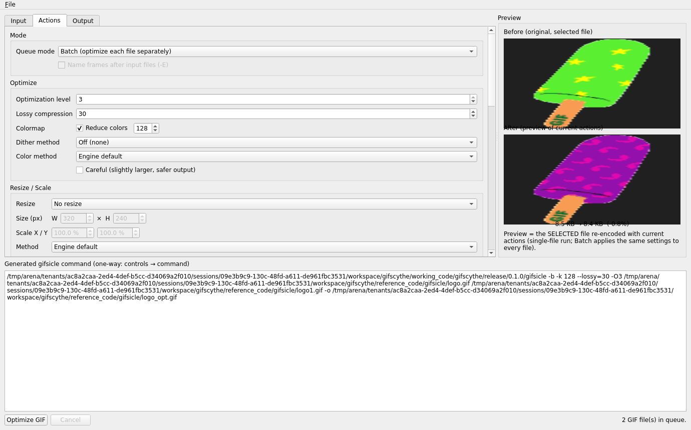
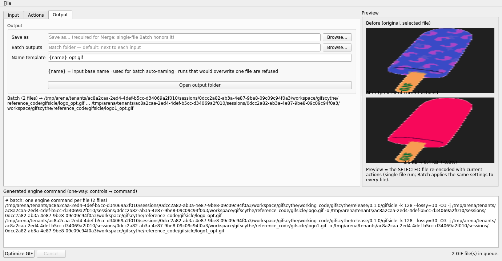

# Gifscythe — work-in-progress (GIF / APNG / WebP animation tool)

**Current product version:** 0.1.0 (see `working_code/gifscythe/VERSION.md`)  
**Status:** Engine + control layer + CLI + GUI shippable as pre-release.
P0/P1 silent-failure and honesty fixes landed 2026-09-07 and were **verified
with evidence the same day** (audit §6: CLI/unit/engine/smoke green, offscreen
GUI harness green, Windows engine+CLI proven under Wine). The **XNConvert-style
UI retrofit (S4b)** landed the same day: Input/Actions/Output tabs, ~30
engine-truth controls, debounced async before/after preview, batch output
folder. **Windows CI green and merged 2026-09-07** (PR #5 → `0ad1ff5`; main
runs #23/#24 green on both jobs; binaries banked on Release
`snapshot-2026-09-07`); S5/S6 (GUI honesty fixes, offline-only direction,
web demo) merged via PR #6. **S7 (2026-09-10) landed the remaining
sandbox-codeable Phase-1 items:** GUI settings persistence between sessions
(SettingsIO-backed, `GS_SETTINGS_PATH` override), queue reorder (Move
Up/Down), free-form `{name}` naming templates (default renders the
historical `<name>_opt.gif` exactly; collision runs are refused), and the
release-procedure doc — offscreen harness reached **243 checks, 0 failures**
(T1–T16) in the S7 sandbox. **S8 (2026-09-10) closed 31 audit findings across
two batches, each with executed proof** — including both release blockers:
**U-01** (batch auto-naming could overwrite another output *or the user's
source file*, rc=0) and **U-02** (`package_portable.sh` exited 0 with no GUI in
the folder). New `src/core/OutputPlan.h` + `OutputName.h`,
`scripts/test_package.sh` (9 negative cases), and three web suites; unit suite
at **296 checks, 0 failures** (S11); `verify_audit.sh` now **28 PASS / 0 FAIL /
3 SKIP, exit 0** as measured in the S11 Qt6+cmake sandbox (E9 SKIPs while the
CI workflow change awaits a `workflows`-scoped token —
`docs/ci/PENDING_WORKFLOW_CHANGE.md`). See `docs/audit/REMEDIATION_2026-09-10.md`.
**S9 (2026-09-10) added the status-tracking system:** `STATUS.md` is now the
single status register (four states — DONE / PARTIAL / OPEN / UNTRIAGED),
`scripts/check_docs.sh` emits and enforces it, `verify_audit.sh` gates **F1/F2**
run it as part of the one-command suite, and `.githooks/pre-push` blocks a push
whose docs are stale. S9 also found and fixed two doc/code drifts the old
process had missed (**N-01**: the pending-workflow marker outlived the change it
described, leaving eight doc locations quoting the wrong gate count; **N-02**:
`web/README.md` documented the pre-U-06 bind address). Remaining: clean-Windows
desktop probes (C4/D3/D4, B5/B6/B14 — checklist in
`docs/ci/CLEAN_WINDOWS_SMOKE.md`), the release re-cut (U-09), the UI-thread
waits (U-12, scoped as P1-24), the two-way-CLI decision, and the version
decision (0.2.0 vs 1.0.0, owner's call). WebP/APNG deferred.
**S10 (2026-09-11) closed 9 audit findings plus the untriaged N-03, with
executed proof.** The S10 sandbox installed the full toolchain (cmake 3.25.1 +
Qt 6.4.2 via apt), so for the first time since S7 the offscreen GUI harness was
compiled **and run locally**: **306 checks, 0 failures** (T1–T20). Closed:
**U-45** (the last P0-1 gap — the whole output group, Browse buttons included,
locks during a run), **U-16** (atomic settings persistence: tmp+fsync+rename in
core, QSaveFile in the GUI), **U-34/U-47** (preview invalidation + temp-file
hygiene), **U-35** (Run re-enable re-checks the engine), **U-36** (the third
settings parser is gone), **U-37** ("persistence unavailable" status note),
**U-40** (`--strict`, exit 3), **U-42** (web Scale X/Y parity). **N-03**: the
screenshots were re-shot offscreen from the current UI and are now linked from
this README. **R-01** closed by the local measurement. Suite counts this
session: unit **238**, smoke **9/9**, web **15/15 + 19/19 + 18/18**, harness
**306**. **Pushed:** branch `arena/s10-gifscythe`, **PR #13** open against
`main`; CI on the PR is the first compilation of the S10 changes. PR #13
merged as `2176573` (CI green on `9435d71`: linux + windows).
**S11 (2026-09-12) closed 4 more findings plus provenance work, each with
executed proof** — the sandbox again had the full toolchain (cmake + Qt 6.4.2
via apt) **plus mingw-w64 and Wine 8**, which flipped U-07 from "needs a real
Windows run" to executable here: **U-15** (CMake no longer writes into `src/`;
template moved to `build_support/`, new gate C9 proves a build with the
committed `version.h` deleted), **U-17** (explode runs verify their frames —
`src/core/ExplodeVerify.h` snapshot-diff shared by CLI and GUI; a lying engine
that exits 0 without writing is refused at every layer, under Wine too),
**U-07** (`CreateProcessW` + `GetCommandLineW` argv re-fetch + UTF-8 env reads
+ `u8path_compat` at every string↔path boundary; Wine E2E: an `é`-path conf
runs rc=0 where the old build fails rc=1, and CJK reaches the child's UTF-16
command line byte-exact), **U-41** (web demo grew all four modes: mode
selector + multi-file queue UI, `POST /run` JSON endpoint with desktop batch
planning/collision refusal and explode frame verification), **U-10**'s
provenance half (fresh upstream clone diffed: `reference_code/gifsicle` is
byte-identical to `kohler/gifsicle@07f5c4c3` except the handwritten
`config.h`; digests recorded in the manifest) and **U-12** scoped as P1-24
(deliberately not refactored — the freeze is untestable offscreen). New
Two new findings were found AND closed in-session: **N-04** (MinGW's
non-UTF-8 `fs::path` narrow conversions) and **N-05** (multi-input Explode
silently scattered frames — every input but the last exploded into the CWD
with rc=0; now refused by validate/CLI/GUI/web alike). Suite counts this
session: unit **296**, smoke **14/14**, web **17 + 23 + 30**, harness
**324**, `verify_audit.sh` **28/0/3**.
**Direction (2026-09-09): offline-only, language stays C++17/Qt6 through 1.0.0**
— see `docs/planning/OFFLINE_BUILD_REVIEW.md`.

This repository deliberately separates **reference code** from **working code**
so the finished product is never confused with source-material we copied or
fetched.

## Quick start

```bash
cd working_code/gifscythe
./build.sh                  # engine + CLI + unit tests
./scripts/test_engine.sh
./scripts/smoke_cli.sh
./build/gifscythe-cli examples/animation.conf          # print command
./build/gifscythe-cli examples/animation.conf --run    # run engine
./build.sh --all            # also Qt6 GUI (fails honestly if Qt missing)
./scripts/check_docs.sh     # documentation gate — green before any PR
```

## Screenshots (S10 refresh, offscreen Qt 6.4.2 — see docs/screenshots/README.md)

| Input tab — queue, reorder, before/after preview | Actions tab — full control surface | Output tab — template, batch folder, summary |
|---|---|---|
|  |  |  |

## Repo layout

```
gifscythe/                        (repo root)
  STATUS.md                       THE status register (4 states, generated)
  PROJECT_VISION.md               what the product is
  WORKLIST.md                     task board (P0–P3)
  SESSION_HANDOFF.md              notes for the next session
  IMPROVEMENT_LOG.md              decision/change log
  FEASIBILITY_REVIEW.md           architecture + gifsicle flag mapping
  COMPILED_AUDIT.md               master audit checklist (start here for reviews)
  LICENSE / COPYING.gifsicle      license notices (GPLv3 UI intent + GPLv2 engine)
  README.md                       this file
  docs/
    audit/REMEDIATION_2026-09-10.md    S8: what was fixed + the executed proof
    audit/FIX_PICK_2026-09-10.md       S8: how U-01 was chosen (superseded)
    archive/                           the two dated review snapshots (historical)
    planning/OFFLINE_BUILD_REVIEW.md   offline-only feasibility + language + plan
    release/RELEASE_PROCEDURE.md       how to cut snapshots/releases (S7)
    web/WEB_FEASIBILITY.md             web-run review (web/ = demo only)
    ci/                            workflow docs + clean-Windows smoke checklist
    screenshots/                   UI screenshots (see docs/screenshots/README.md)
  .githooks/pre-push               blocks a push with a red documentation gate
  web/                             server-side web POC + JS⇄C++ command parity test

  reference_code/                 SOURCE MATERIAL — do not edit, do not ship
    gifsicle/                     canonical gifsicle 1.96 source
    gifsicle-nested-1.96/         older alternate variant (reference only)
    gifsicle-upstream/            shallow clone (auto-fetched, gitignored)
    caesium-source/               Caesium UI source GPLv3 (auto-fetched, gitignored)
    caesium-bin/                  Caesium Win bundle — portable Qt pattern only (gitignored)

  working_code/                   THE PRODUCT — edit & ship this
    gifscythe/                    the app (v0.1.0)
```

## What is reference vs. working
- **reference_code/** — unmodified source material we reference, adapt, or bundle
  into releases. **Never edit** these; treat them as read-only imports.
- **working_code/** — our actual product. All edits happen here.
- Large auto-fetched trees (`gifsicle-upstream`, `caesium-source`, `caesium-bin`)
  are gitignored; re-fetch or see `reference_code/REFERENCE_MANIFEST.md`.

## Docs for reviewers / next session
0. **`STATUS.md`** — the single status register. Start here: one row per tracked
   item, four states, and a generated header that says how much is done. Run
   `working_code/gifscythe/scripts/check_docs.sh` to verify it is current.
1. **`COMPILED_AUDIT.md`** — findings, what was fixed, §6 verify-before-trust.
   This is the *detail* behind the `U-nn` rows in `STATUS.md`.
2. **`SESSION_HANDOFF.md`** — current state + constraints.
3. **`WORKLIST.md`** — short checkbox board toward 1.0.0.
4. **`docs/planning/OFFLINE_BUILD_REVIEW.md`** — offline-only feasibility,
   language choice (stay C++/Qt through 1.0.0), and the phased plan.
5. **`docs/web/WEB_FEASIBILITY.md`** — web-run review (the `web/` build is a
   demo/parity harness, not the product path).
6. **`docs/release/RELEASE_PROCEDURE.md`** — how to cut a snapshot or version
   release (gates, packaging, publishing, post-publish verification).

## Versions
The *product* version lives in `working_code/gifscythe/VERSION.md`; `build.sh`
syncs it into the committed `src/core/version.h` fallback, while CMake
generates its own copy inside the build tree only (S11, audit U-15).  
0.1.0 (now) → 1.0.0–1.9.9 (finished GIF product) → 2.0.0–3.0.0 (WebP + APNG).  
**Never call it 1.0.0 until the UI/UX task is done.**

## License note
gifsicle remains a **separate subprocess** (GPL v2-only). The UI/control layer
is intended GPLv3-compatible with the Caesium-derived UX base. See `LICENSE` and
`COPYING.gifsicle`.
